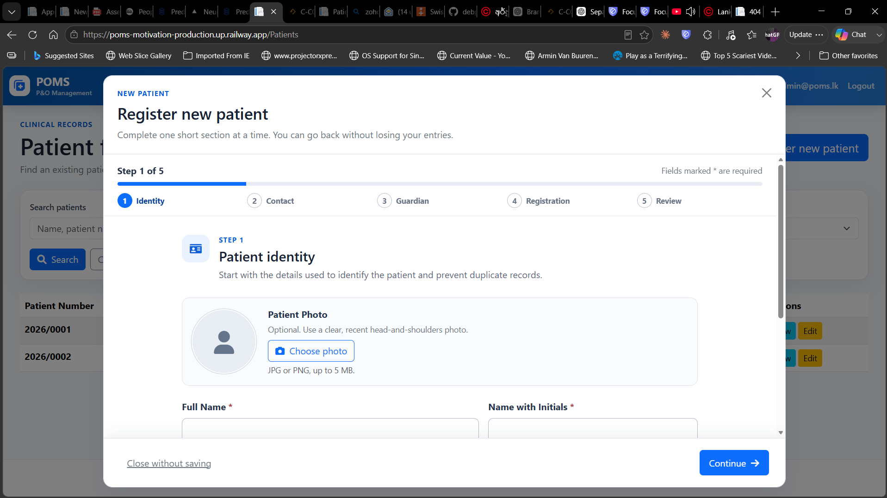

 these forms could fit in to screen within browser if we make headers smaller. and fonts may be too right ? . what do you think ? we  give options in the admin to change  sizez ?  But I think from  header text and sections allocate too much space so users have to scroll more to the down . 

fix tab orders and showrt cuts in forms. tab initally focused to page header tests which shouldnt be . 

whan patients inital information registered final confirmation page also hould display image too which if the user wants click and zoom too.

email address should support N/A 

Identification Type should support N/A and disbled number text

records should be clinical records

Subtype text only visible when slect other from Prescription drop down 

New Appointment page record patient  should provide on type search capabilities . qalso record drop down shold provide more details if there are any 

Handled By (Prosthetist / Orthotist) should bring searchable dropdown of available clinicians .